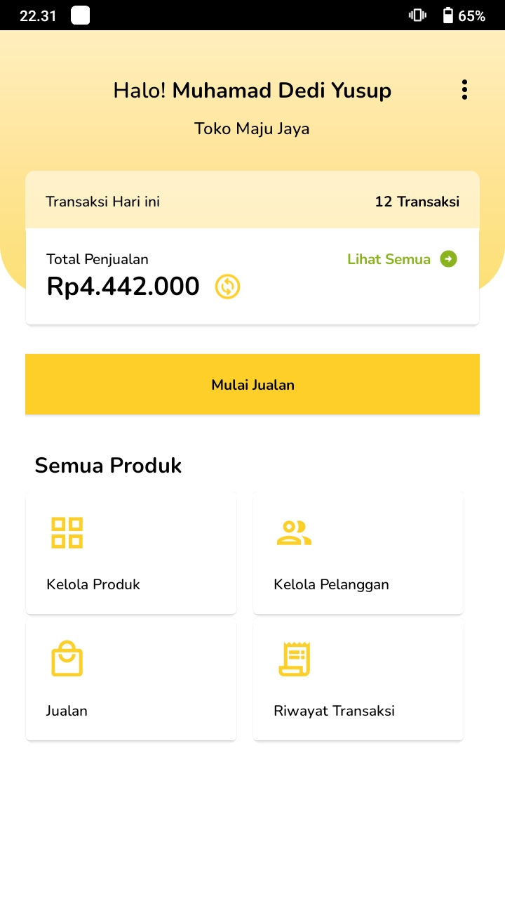

# Responsi Pemrograman Perangkat Bergerak - Universitas Janabadra   
 
    
Repositori ini dibuat untuk pemenuhan syarat kelulusan pada mata kuliah <b>Praktikum Pemrograman Perangkat Bergerak.</b>  

## Demo    

    
    
    
    
    
    

  
## Feature :
- Main Page
- Page Riwayat Transaksi
- Page Jualan
- Page Kelola Pelangan
- Page Kelola Produk
- Data disimpan pada Object
    
## Author
Nama : <b>Muhamad Dedi Yusup</b> 
NIM  : <b>19330015</b>
